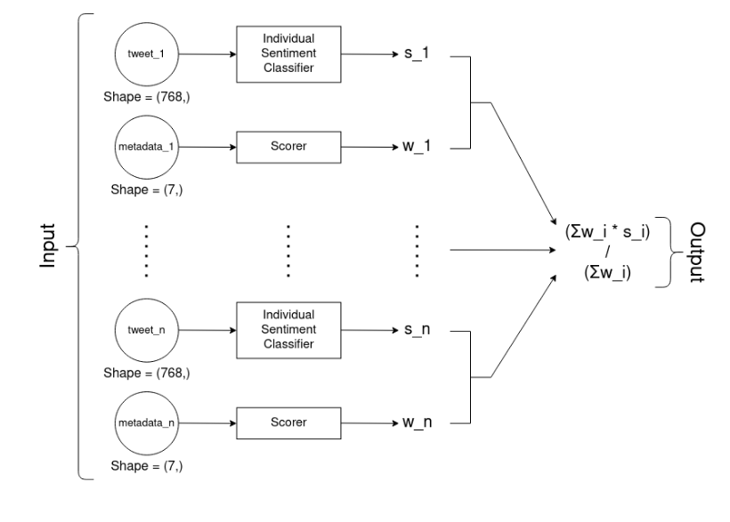

### Our Goal:

Predict the market sentiment about Bitcoin as an aggregation of the individual tweet sentiments.

## Literature review of the previous works:

In all the papers that we have reviewed, a set of individual tweet sentiments (labels) were given by a
human. Then a model is trained on these manually labeled tweets. Finally, in order to aggregate the
individual tweet sentiments to a global market sentiment, a (weighted) average is employed.
However this approach seems to have many shortcomings:
- The limitations that come with the manual labeling: Even though we can easily scrape thousands/
millions of tweets, the manual step remains extremely time consuming and is thus a huge bottleneck.
- Aggregating the individual sentiments with a naïve average implicitly bears the assumption that all
tweets are equally important/ impactful on the overall market sentiment. However, we don’t think
this is the case, since we expect a public figure like Elon Musk to have far more impact than a random
twitter user with 0 followers.

## Overcome the manual labeling bottleneck:

We suppose that the overall market sentiment and the BTC price movements are highly correlated.
For instance: if as much as 90% of the tweets published between 08:00 and 09:00 are positive, we
assume/ expect that a jump in BTC price will occur and vice versa.
Also notice that we are referring to the overall market sentiment instead of the individual tweet
sentiments. In other words, if a single tweet published at 08:00 is negative, this doesn’t necessarily
mean that the price is going to drop. However if the majority of tweets in the same time window are
negative then most probably the price is going to fall.

Therefore instead of labeling single tweets at a time (individual sentiments), we decided to label sets
of tweets (overall sentiments):
- Model Input: Set of scraped tweets from a fixed time window, e.g. 01.01.2021 between 08:00 and
09:00.
- Label: ‘Positive’ if the asset price jumped up during that time window. ‘Negative’ if the price went
down. (Possibly a third class ‘neutral’ if the price didn’t change more than a threshold value, e.g. 1%)

## How to deal with different input lengths?

Now that the model’s inputs are tweet sets instead of individual tweets, even though each tweet in
itself is limited to 280 characters, the number of tweets per set is variable. However Neural Networks
require a fixed input shape.
- One possible solution would be using padding and attention_masks. We pad all tweet set to
max(tweet_set.length). Then using an attention_mask tensor, we make sure to neglect the masked
tweets.
- Another, easier to implement, solution is truncating the tweet sets to common fixed size (e.g. 100)
while discarding sets that contain less tweets than that (tweet_set.length < 100). This is the approach
we went for.
  
## Can we do better than a naïve average?

We could assign different weights to different tweets in a "static" fashion. For instance based on the
number of likes, number of followers, number of retweets etc. Then we perform a weighted average
instead of a simple average.
However, we wouldn't consider this a good solution, since a static weighting function is, as the name
suggests, not trainable. Depending on how we define it, it can thus represent a bottleneck for our
model’s accuracy.
* Make the model figure out a suitable weighting function, based on the tweets metadata, as
part of the training process.

## Final Model Architecture:

